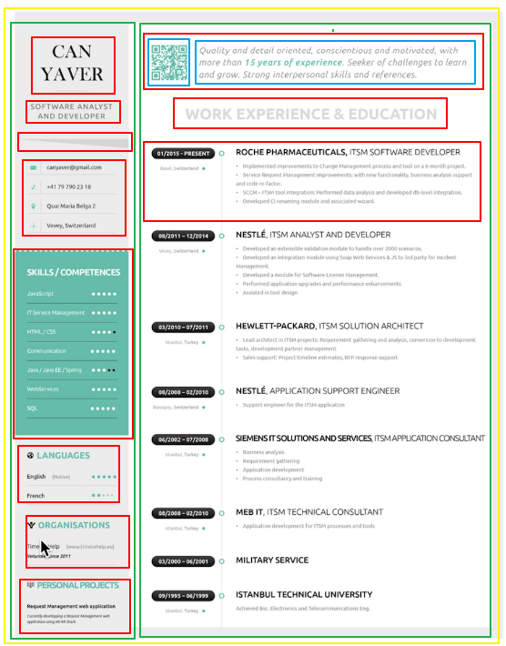

# v1

> 此简历需要不断完善……所以先搞个基本的！

## ★设计稿

**➹：**[85338522.jpg (918×1172)](https://cloud.hunger-valley.com/18-11-7/85338522.jpg)

## ★想想怎么做？

**①对设计稿化格子，抽象成一个个矩形**

> 这种姿势有个名字叫做「略图」

大概像下面这样画画即可：



> 你无须完整实现出来，毕竟这个简历是你个人的……

**②搞HTML，搭个骨架出来**

语义化标签，[HTML5 标签列表 - Web 开发者指南 - MDN](https://developer.mozilla.org/zh-CN/docs/Web/Guide/HTML/HTML5/HTML5_element_list)

如果找不到合适的语义化标签，那么用了class、id这些属性，然后你说该写些什么值才行？即如何定义这块东西的名字？

BEM 是一种基于组件的命名方法

**③搞CSS，让页面表现出有活力的既视感**

1. reset.css
2. commom.css
3. main.css


## ★总结

- 写起来很慢啊！
- 我本来打算写死高度的，可是想了想，是可以用padding之类的呀！
- 难道我真得要PC端写一份，然后移动端又写一份？

## ★Q&A

### ①flex item设置max-width无效？

> 需求：aside在窗口缩放时会等比缩放！

然后就弄了min-width，结果min-width是有效的，但是当窗口缩小到一定程度时，这显然是不行的哈！

根据flex-basis的描述：

> **定义了在分配多余空间之前，项目占据的主轴空间，浏览器根据这个属性，计算主轴是否有多余空间**

它的取值：

```css
.item {
    flex-basis: <length> | auto;
}
```

默认值：auto，即项目本来的大小, 这时候 item 的宽高取决于 width 或 height 的值。

既然如此，为啥min-width无效，而min-width有效呢？

讲真不知道哈！

既然它有个 `length`值，那么我就搞个25%的值试试呗！

结果是我想要的！即该item始终会保证占整个容器的25%的宽度

> 关于这个属性，最好还是用shorthand哈！w3c有说到，即shorthand那种姿势有更明智的默认值哈！

当然你直接使用`width:25%;`也是可以的！

### ②让整个页面的元素都是弹性的，难道都得弄成是百分比吗？

不管是content、padding还是margin……

### ③伪元素？

伪类1个冒号，而伪元素两个冒号

**➹：**[大放异彩的伪元素——可以做什么？_CSS3, 伪元素 教程_w3cplus](https://www.w3cplus.com/css3/pseudo-element-roundup.html)

**➹：**[伪类和伪元素 - 学习 Web 开发 - MDN](https://developer.mozilla.org/zh-CN/docs/Learn/CSS/Introduction_to_CSS/Pseudo-classes_and_pseudo-elements)

### ④元素之间的间距，你说用padding好还是margin好？

此刻我认为是padding，因为padding还是在border中！如果用margin的话，给我就像是两个元素存在依赖的感觉，而padding则让我感觉这个元素是独立的！

### ⑤话说，padding的百分比值是相对于父元素的宽吗？

当margin/padding取形式为`百分比`的值时，无论是left/right，还是`top/bottom`，都是以`父元素的width`为参照物的！

自适应的精髓在于宽度，`margin/padding设置百分比`弥补了元素高度无法**自适应地**与元素宽度保持一致的缺陷。

**➹：**[巧用margin/padding的百分比值实现高度自适应（多用于占位，避免闪烁） - 实用至上 - SegmentFault 思否](https://segmentfault.com/a/1190000004231995)

### ⑥关于中文字体的选择？

**➹：**[中文网页用什么字体最合适？ - 知乎](https://www.zhihu.com/question/20404847)

**➹：**[推荐！Web中文字体应用指南 - 优设网 - UISDC](https://www.uisdc.com/web-font)

**➹：**[css - 在web上显示各种操作系统上最优的中文字体列表 - SegmentFault 思否](https://segmentfault.com/q/1010000000122887)

**➹：**[中文字体网页开发指南 - 阮一峰的网络日志](http://www.ruanyifeng.com/blog/2014/07/chinese_fonts.html)

### ⑦如何画个三角形？

此刻，我只能偷个懒用工具生成三角形了！

**➹：**[有谁能详细讲一下css如何画出一个三角形？怎么想都想不懂？ - 知乎](https://www.zhihu.com/question/35180018)

**➹：**[CSS三角形產生器](http://apps.eky.hk/css-triangle-generator/zh-hant)

**➹：**[CSS三角形生成器](https://leekoho.github.io/)

### ⑧为啥border-width为百分比值居然没有效果？

就是不支持啊！我想弄出随着窗口的缩放这个三角形也会等比缩放啊！

我觉得这可以用svg来做啊！

**➹：**[Box model](https://www.w3.org/TR/CSS21/box.html#border-width-properties)

**➹：**[CSS 中 border-width 为何不支持百分比？ - 知乎](https://www.zhihu.com/question/21136831)

### ⑨关于选择器，假如兄弟元素是一样的元素，那么该如何区别选择它们？

`E:nth-child(n)`：匹配其父元素的第n个子元素，第一个编号为1

**➹：**[CSS选择器笔记 - 阮一峰的网络日志](http://www.ruanyifeng.com/blog/2009/03/css_selectors.html)

### ⑩绝对居中的几种姿势？

常见的flex布局姿势：

```css
#container{
    display:flex;
    justify-content:center;
    align-items: center;
}
```

**➹：**[【前端攻略】最全面的水平垂直居中方案与flexbox布局 - ChokCoco - 博客园](http://www.cnblogs.com/coco1s/p/4444383.html)

### ⑪在用flex做绝对居中的时候，flex容器的padding能否影响flex item的绝对居中？

确实会影响，居中相对的是content啊！

<script async src="//jsfiddle.net/Ambler/u4mgbxpv/4/embed/html,css,result/"></script>


⑫⑬⑭⑮⑯⑰⑱⑲⑳


